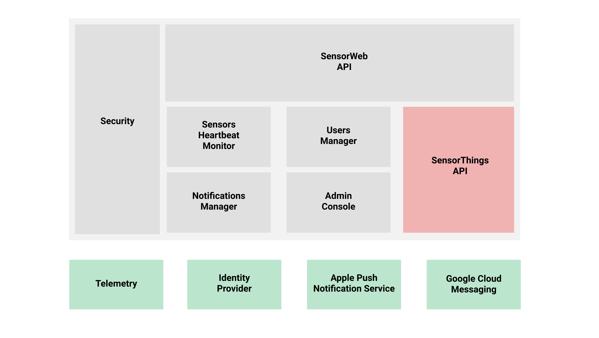

# SensorWeb cloud service(s)
## High level architecture

## Components
### SensorWeb API
Public REST API to be consumed by Mozilla's SensorWeb client apps and sensor stations and potentially by other 3rd party apps and associated devices.

The WIP documentation for this API can be found [here](https://github.com/mozilla-sensorweb/sensorweb-server/blob/master/doc/API.md).

### SensorThings API
The [SensorThings API](http://docs.opengeospatial.org/is/15-078r6/15-078r6.html) is an [OGC](http://www.opengeospatial.org/) standard specification for providing an open and unified way to interconnect IoT devices, data, and applications over the Web. This is the core piece of SensorWeb in charge of managing the list of registered sensors and its data. We will be working on our own open source implementation of this API. While we work on it, we will use [SensorUp](http://www.sensorup.com/)'s sandbox to unblock the development of other SensorWeb components.

### Notifications Manager
We need to send push notifications to different client platforms. The targets are iOS and Android so far, but in the future we may also want to add web clients as target for push notifications. The Notifications Manager component abstracts the usage of the Apple Push Notification Service and the Google Cloud Messaging service.

### Sensors Heartbeat Monitor
This component is in charge of identifying scenarios where a sensor station loses connection or starts malfunctioning. In this situation we are required to send a notification to the owner of the failing sensor station. For example, to detect that a sensor lost its connection to the server this component can periodically query the database through the SensorThings API looking for active sensors that have not pushed new observations for the last X seconds or minutes.

### Users Manager
Each SensorWeb API client will have its own list of users manage through this component. User authentication will be done through a external Identity Provider (still TBD).

### Admin Console
Frontend to manage things like API credentials and users. The code for this component lives [here](https://github.com/mozilla-sensorweb/sensorweb-admin-panel).

## External components
### Telemetry
We will be using [Metrics for Mozilla Connected Devices Projects](https://github.com/tamarahills/metrics_controller)

### Identity Provider
TBD. We will probably use [Firefox Accounts](https://developer.mozilla.org/en-US/docs/Mozilla/Tech/Firefox_Accounts).

### Apple Push Notification Service
[Apple Notifications](https://developer.apple.com/notifications/)

### Google Cloud Messaging
[GCM](https://developers.google.com/cloud-messaging/)

## Storage
<s>[Crate.io](https://crate.io/)</s> [PostgreSQL](https://www.postgresql.org/) and [PostGIS](http://postgis.net/)
